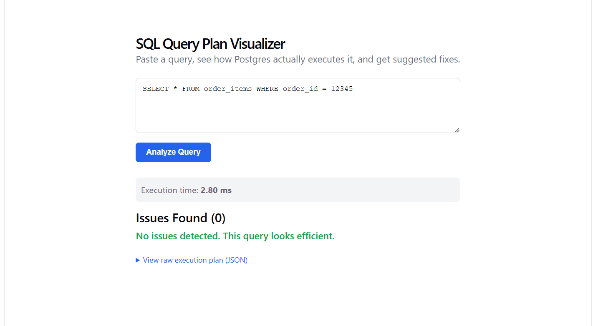
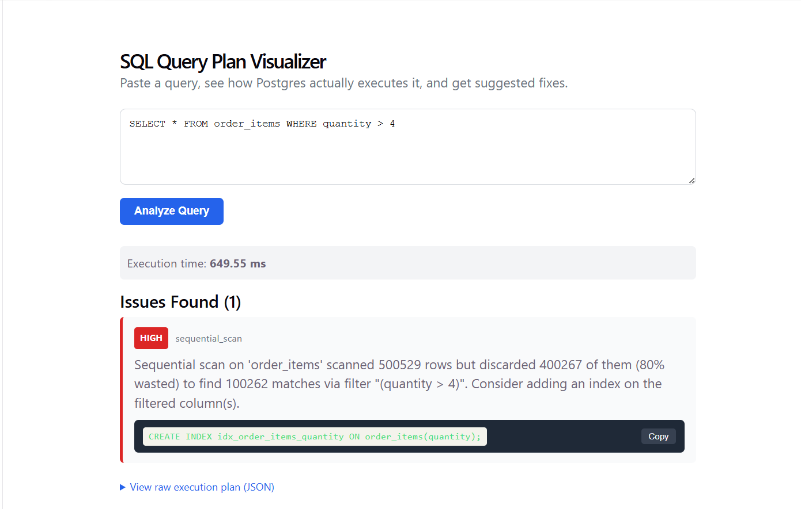

# SQL Query Plan Visualizer & Optimizer Advisor

A full-stack tool that takes any SQL query, runs it through PostgreSQL's query planner, and automatically detects performance anti-patterns — returning specific, actionable index suggestions to fix them.

Built as a portfolio project to demonstrate systems thinking, backend engineering, and applied database knowledge.

---

## The Problem

Most developers write SQL that "works" but never look at how the database actually executes it. A query that's fast on 1,000 rows can fall over at 500,000 rows — and the difference is almost always visible in the execution plan, if you know how to read one.

This tool makes that invisible step visual and automatic.

---

## Demo

**Before adding an index — 225ms execution time, 166,843 rows scanned to find 1 match:**

**After applying the suggested index — 2ms execution time, clean result:**

That's a ~110x speedup from a single index the tool suggested automatically.

---

## Features

- Paste any SQL query and get back its full execution plan as structured JSON
- Automatically detects 3 anti-patterns:
  - **Sequential scans** that waste work (distinguishes genuinely wasteful scans from necessary full-table reads)
  - **Bad row estimates** (stale table statistics), with a fix for false positives caused by `LIMIT` clauses
  - **Expensive nested loop joins** on large row counts
- Generates real, copy-pasteable `CREATE INDEX` SQL statements based on the detected filter columns
- Error handling — bad SQL returns a clean error message, not a server crash
- Before/after comparison: apply the suggested index and re-run to confirm the issue is gone

---

## Tech Stack

| Layer | Technology | Why |
|---|---|---|
| Database | PostgreSQL 16 (Docker) | Industry standard, excellent `EXPLAIN ANALYZE` JSON output |
| Backend | Python + FastAPI | Fast to write, clean async API, great for JSON-heavy work |
| Frontend | React + Vite | Modern, fast dev experience, component-based UI |
| Data generation | Python + Faker | Realistic seed data at scale (700K+ rows) |
| Containerization | Docker + docker-compose | Reproducible, portable database setup |
| Version control | Git + GitHub | Full commit history showing incremental build |

---

## How It Works

1. User pastes a SQL query into the frontend
2. React sends a `POST /analyze` request to the FastAPI backend
3. FastAPI runs `EXPLAIN (ANALYZE, FORMAT JSON)` against PostgreSQL
4. The analyzer walks the returned plan tree recursively, checking each node for anti-patterns
5. Detected issues are returned alongside the raw plan, each with a severity level, explanation, and suggested fix
6. React renders the results: severity badges, issue messages, and copy-pasteable index SQL

---

## Project Structure

---

## Key Technical Decisions & Tradeoffs

**Why recursive tree-walking for plan analysis?**
PostgreSQL's execution plan is a tree, not a flat list — a `Bitmap Heap Scan` node contains a `Bitmap Index Scan` child, which itself might have children. Walking the tree recursively ensures every node at every depth gets checked, regardless of query complexity.

**Why distinguish filtered vs unfiltered sequential scans?**
The naive approach flags every sequential scan as a problem. But a full-table scan with no `WHERE` clause is often intentional — the database correctly needs every row. I added a filter-presence check and a "waste ratio" calculation (rows discarded ÷ rows scanned) to separate genuinely wasteful scans from necessary ones.

**Why skip row-estimate checks under a `LIMIT` node?**
PostgreSQL estimates row counts for the full result set, but `LIMIT` cuts execution short — so `Actual Rows` reflects a truncated count, not a true estimate mismatch. Without this fix, the tool produced false "stale statistics" warnings on any query using `LIMIT`. I fixed it by passing a flag down the tree during recursion to skip the check under `Limit` nodes.

**What's deliberately out of scope**
- Multi-database support (Oracle/MySQL have different plan formats — doing one well beats doing three shallowly)
- User authentication / multi-tenancy
- Full SQL parser for index suggestion (current heuristic covers the most common cases; a full parser would be a future improvement)

---

## What I'd Do Differently at Scale

- Replace the regex-based column extractor with a proper SQL parser (e.g. `sqlglot`) for more accurate index suggestions on complex filter expressions
- Add a side-by-side plan comparison view (before/after applying a suggested index)
- Support saving and replaying query history
- Deploy with proper secrets management (database credentials are currently hardcoded for local dev only)

---

*Built by Damaris Nteseng — Information Technology student, Johannesburg, South Africa*
